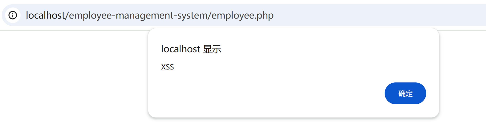

## Employee Management System by rems has xss

BUG_Author: sorcha-l

vendors: https://www.sourcecodester.com/php/17847/employee-management-system-using-php-and-mysql-source-code.html

Vulnerability File: 

/employee-management-system/employee.php

Description:

In the `employee.php` page, when adding an employee, the `Full Name` field of the `employee` does not properly filter or validate user input. An attacker can exploit this vulnerability by injecting malicious scripts, such as `<script>alert('xss')</script>`. These scripts are stored in the database and rendered/executed every time the `employee.php` page is accessed, leading to a cross-site scripting (XSS) attack.

This vulnerability is a stored XSS attack, where attackers can store malicious scripts in the database to affect other users over an extended period. This could potentially lead to session hijacking, page content tampering, or other malicious actions. This issue needs to be addressed promptly to prevent data leakage and unauthorized page modifications.

[+] payload:

```
<script>alert('xss')</script>
```


