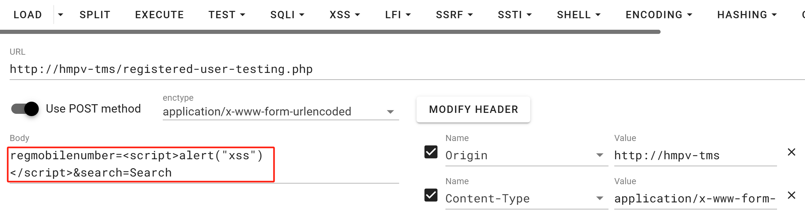
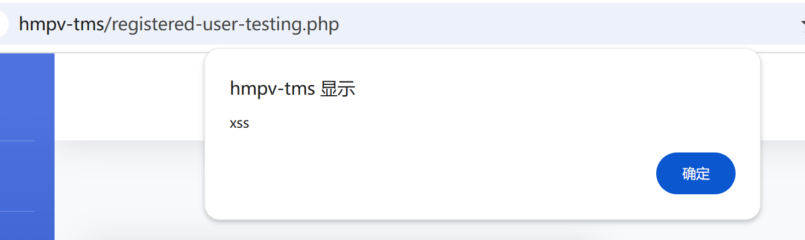
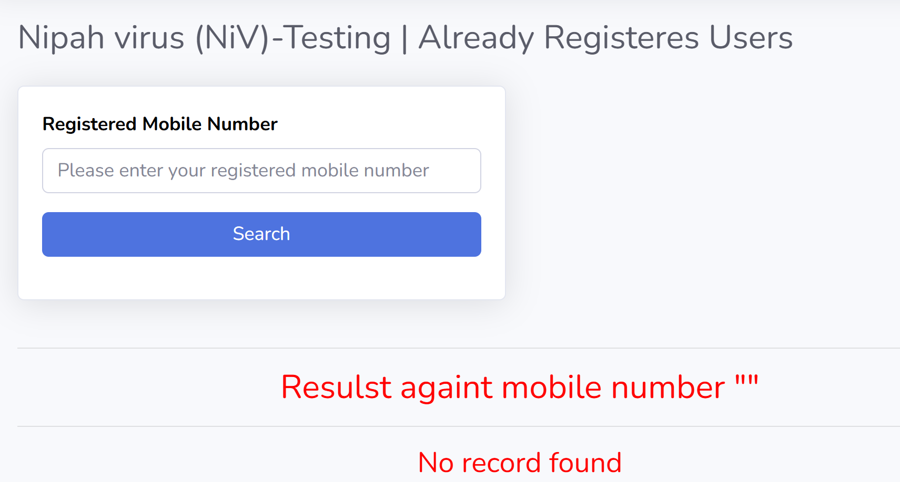

## Human Metapneumovirus (HMPV) – Testing Management System : XSS in registered-user-testing.php

BUG_Author: sorcha-l

vendors: https://phpgurukul.com/human-metapneumovirus-hmpv-testing-management-system-using-php-and-mysql/

Vulnerability File: 

/hmpv-tms/registered-user-testing.php

Description:

There is a Cross - Site Scripting (XSS) vulnerability on the `registered-user-testing.php` page. Although the front - end restricts the `regmobilenumber` input to numbers only, the back - end fails to validate, filter, or encode the output of this parameter. 

Attackers can construct a malicious URL by setting the `regmobilenumber` parameter to `<script>alert("xss")</script>` and adding `search=Search` to simulate a search, bypassing the front - end restriction. When users visit the URL with these malicious parameters, the page will execute the script, triggering an "xss" alert box. 

This high - risk vulnerability allows attackers to create sophisticated malicious scripts to steal users' session credentials and login information, redirect the page to malicious websites, or perform other malicious actions, severely threatening user privacy and system security. 

[+] payload:

```
regmobilenumber=<script>alert("xss")</script>&search=Search
```







