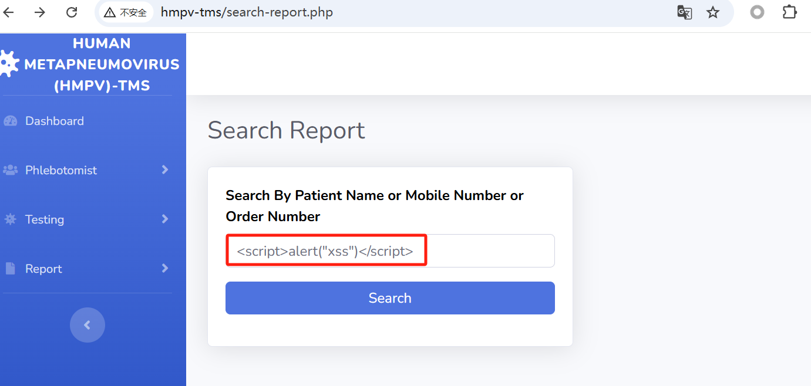
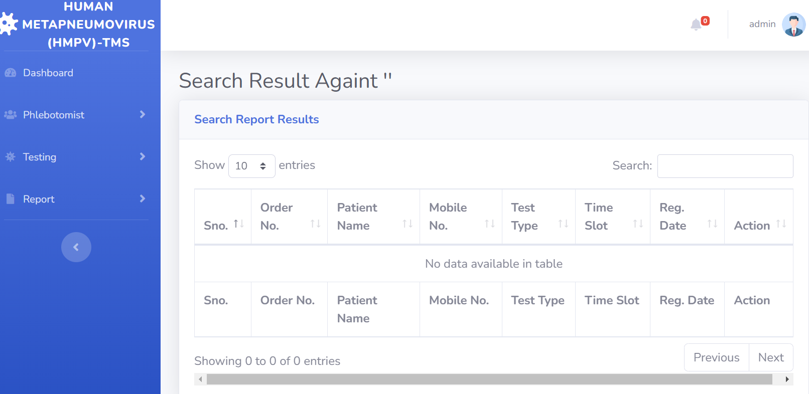

## Human Metapneumovirus (HMPV) – Testing Management System : XSS in search-report.php

BUG_Author: sorcha-l

vendors: https://phpgurukul.com/human-metapneumovirus-hmpv-testing-management-system-using-php-and-mysql/

Vulnerability File: 

/hmpv-tms/search-report.php

Description:

The `search-report.php` page is vulnerable to Cross-Site Scripting (XSS) attacks. Due to insufficient filtering and escaping of search input, an attacker can inject malicious script code (e.g., `<script>alert('xss')</script>`) into the search box and click the "search" button, causing a warning dialog to appear. This vulnerability can be exploited to steal sensitive user information, manipulate browsers, and pose threats to user privacy and system security.

[+] payload:

```
<script>alert('xss')</script>
```







